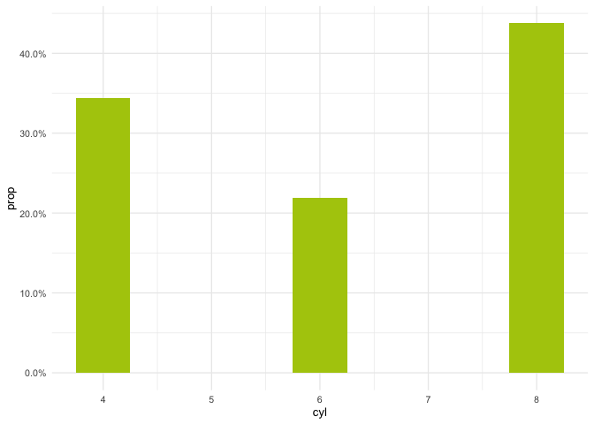

<!-- README.md is generated from README.Rmd. Please edit that file -->

# abjDash


### O que é?

Pacote de desenvolvimento de ferramentas essenciais para os projetos da
[Associação Brasileira de Jurimetria](https://abj.org.br/).

Aqui estão todas as funções auxiliares para os gráficos, tabelas e
dashboards.

### Para instalar

Você pode instalar a versão mais recente do {abjDash} com:

    # Para instalar a versão GitHub (dev)
    install.packages("remotes")
    remotes::install_github("abjur/abjDash")

### Lista de funções

| Função                  | Descrição                                                                     |
|-------------------------|-------------------------------------------------------------------------------|
| `barras_empilhadas`     | Função que cria gráfico dinâmico de colunas por grupo.                        |
| `barras_prop`           | Função que cria gráfico dinâmico de barras com proporção.                     |
| `barras`                | Função que cria gráfico dinâmico de barras.                                   |
| `calcular_estatisticas` | Função que ajuda calcular medias e medianas por intervalo.                    |
| `create_theme_css`      | Função que cria tema CSS para os Dashboards.                                  |
| `custom_lab`            | Função que facilita o cálculo de milhares e milhões.                          |
| `get_median`            | Função que ajuda pegar a mediana de processos por tempo baseada no processo   |
| `grafico_km`            | Função que cria gráfico no modelo de sobrevivência Kaplan-meier               |
| `grafico_km2`           | Função que cria gráfico no modelo de sobrevivência Kaplan-meier (2 variáveis) |
| `histograma`            | Função que cria gráfico dinâmico de histograma.                               |
| `mapa_tematico`         | Função que cria mapa dinâmico com reais e proporção.                          |
| `nprop`                 | Função que retorna porcentagem no formato NN (PP).                            |
| `pct`                   | Função que define porcentual.                                                 |
| `picker_options`        | Função que customiza inputs widgets shiny.                                    |
| `pizza`                 | Função que cria gráfico dinâmico de pizza.                                    |
| `prop_agg`              | Função de agregação personalizada em JavaScript. (Render)                     |
| `reais`                 | Função que cria ferramenta para definir reais.                                |
| `status_para_cor`       | Função que cria cores para os status dos dashboards.                          |
| `tabela`                | Função que ajuda definir tabelas.                                             |
| `tempo_lab_one`         | Função que ajuda calcular tempos.                                             |
| `tempo_lab`             | Função que retorna um vetor de tempos.                                        |

### Alguns exemplos de como usar as funções:

-   `reais`

``` r
abjDash::reais(c(1, 2, 3, 4, 4, 6))
#> [1] "R$ 1" "R$ 2" "R$ 3" "R$ 4" "R$ 4" "R$ 6"
```

-   `pct`

``` r
library(magrittr)
library(ggplot2)
library(abjDash)

mtcars %>% 
  dplyr::count(cyl) %>% 
  dplyr::mutate(prop = n/sum(n)) %>%
  ggplot2::ggplot() +
  ggplot2::aes(x = cyl, y = prop, label = pct(prop)) +
  ggplot2::geom_col(fill = "#AFCA0A", width = .5) +
  ggplot2::scale_y_continuous(labels = scales::percent) +
  ggplot2::theme_minimal(10)
```



## Templates disponíveis

Para as funções de módulo Server, UI e app Server deixamos disponíveis
drafts:

#### Exemplo de uso

``` r
abjDash::template_app_server()
```

## Requisitos

`{abjDash}` requer uma versão do R superior ou igual a 3.6.

### Licença

O sistema de gerenciamento de conteúdo `{abjDash}` é licenciado sob os
termos da [MIT + file
LICENSE](https://github.com/abjur/abjDash/blob/master/LICENSE)
